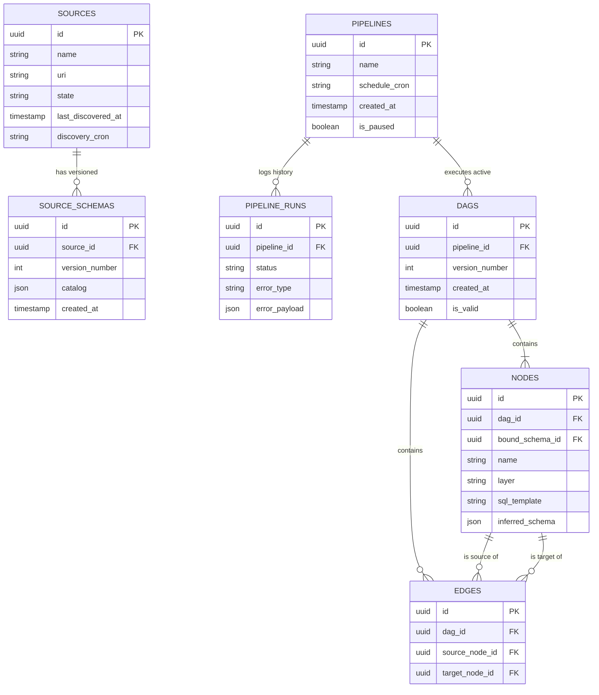

# ADR 04: SQLite Refactoring & Pipeline-DAG Ontologies (DEPRECATED)

> **DEPRECATION NOTICE:**
> This monolithic ADR has been deprecated and split into logically isolated documents to improve maintainability and adherence to Domain-Driven Design boundaries. 
>
> Please refer to the following active Architecture Decision Records:
> *   **[ADR 05: Source Entity & Schema Versioning Management](./05-adr-source-schema-management.md)**
> *   **[ADR 06: Pipeline Operational Shell & Execution Tracking](./06-adr-pipeline-administration.md)**
> *   **[ADR 07: DAG Mathematical Topology & Validation](./07-adr-dag-topology.md)**

---

### System Data Model Overview

The following Entity-Relationship diagram illustrates the decoupled database architecture defined across the split ADRs.

