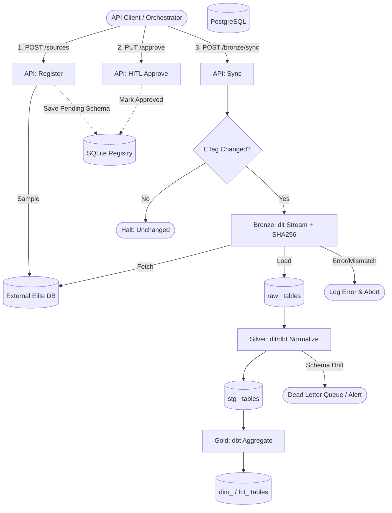
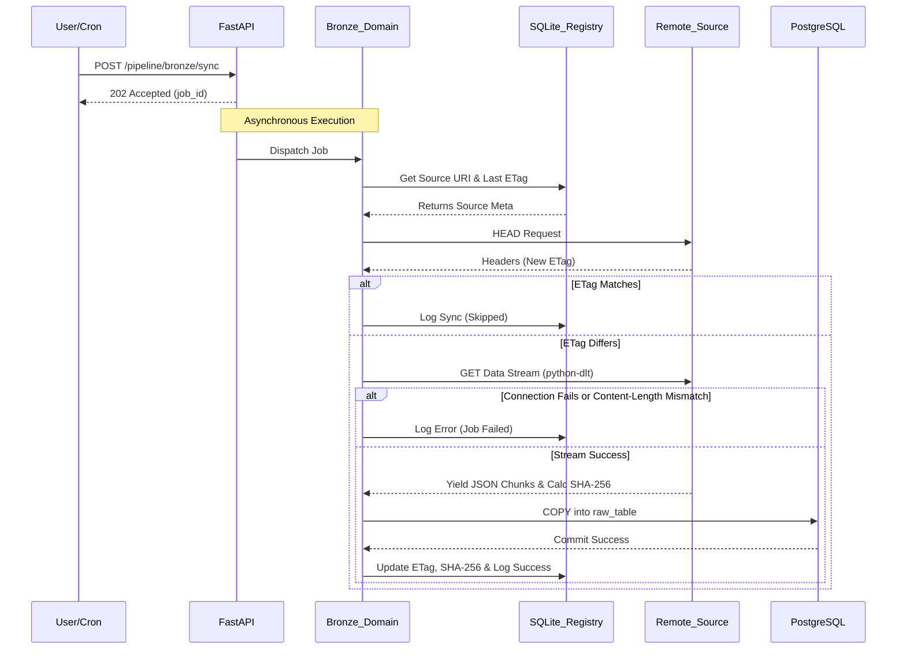

# Master ETL Workflow

This document outlines the end-to-end trajectory of the Elite Dangerous ETL Pipeline, from source registration to final Gold layer materialization. It incorporates the Hexagonal API architecture and Medallion data engineering practices.

## 1. Phase A: Registration & Onboarding (HITL)
1.  **Request:** User submits a `POST /api/v1/sources/` with a download URI.
2.  **Sampling:** The Bronze service fetches a micro-sample of the JSON. A base sample size of `2MB` is used to capture a full record. If overridden, the chosen `sample_size_mb` is tracked in the registry.
3.  **Schema Inference:** `genson` infers a schema from the sample.
4.  **Off-Ramp (Error):** If the URI is invalid or unreadable, return `400 Bad Request` and log the failure.
5.  **HITL Approval:** The inferred schema is stored in the SQLite Registry pending Human-in-the-Loop approval via `PUT /api/v1/sources/{id}/approve`.

## 2. Phase B: Bronze Synchronization & Ingestion
1.  **Trigger:** A scheduled Cron job or a manual `POST /api/v1/pipeline/bronze/sync`.
2.  **Tier 1 Check:** The Bronze service requests HTTP Headers from the source.
3.  **Off-Ramp (Skip):** If the `ETag` matches the one in the SQLite Registry, execution halts (Data is unchanged).
4.  **Streaming & Tier 2/3 Check:** `python-dlt` streams the JSON/JSON.GZ. Concurrently, it verifies `Content-Length` and generates a streaming `SHA-256` hash. *(Note: During testing, a `limit_mb` parameter can be passed to partially download massive files).*
5.  **Landing:** Data is loaded directly into `raw_<source_name>` in PostgreSQL. The `SHA-256` hash is committed to the Registry.
6.  **Off-Ramp (Error):** If memory thresholds are breached, connection drops, or the `SHA-256`/`Content-Length` validation fails, the transaction rolls back.

## 3. Phase C: Silver Normalization
1.  **Trigger:** `POST /api/v1/pipeline/silver/normalize`.
2.  **Extraction:** The Silver service reads from `raw_` tables.
3.  **Transformation:** `python-dlt` (or `dbt`) normalizes column names to `snake_case`, un-nests arrays into relational child tables, and explicitly casts data types (e.g., `::timestamp`).
4.  **Landing:** Data is written to `stg_<entity>` tables.
5.  **Off-Ramp (Error):** If schema drift occurs (the raw data violates expected types), the anomalous rows are sent to a Dead Letter Queue (DLQ) or the job fails safely, triggering a Webhook alert.

## 4. Phase D: Gold Aggregation
1.  **Trigger:** Orchestrator initiates Gold modeling post-Silver success.
2.  **Modeling:** `dbt` executes modular SQL macros against the `stg_` tables.
3.  **Materialization:** Final `dim_` (dimension) and `fct_` (fact) tables are generated for production analytics.

---

## Architecture Flowchart

---

## Sequence Diagram (Sync & Ingest)

