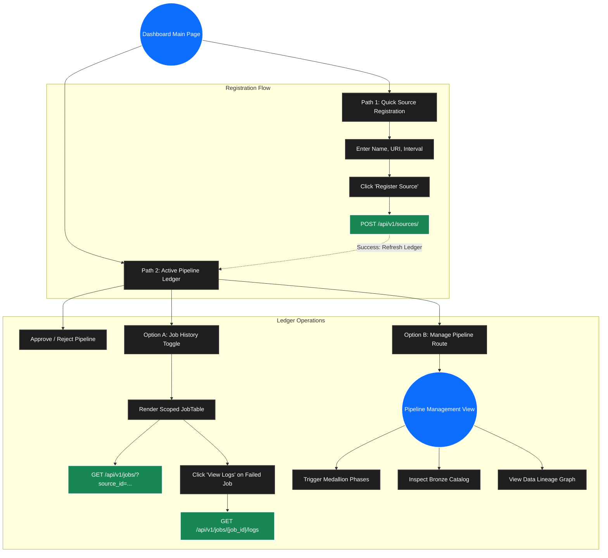

# Pipeline Creation and Management Flow

This document details the user flow and page design for Pipeline Creation and Management within the Elite Dashboard. It acts as the orchestration roadmap starting from the dashboard's main landing page (`/`).

## The Two Primary Paths

When a user lands on the dashboard, they interact with the unified command center which immediately diverges into two primary operational paths for pipeline administration.

### Path 1: Quick Source Registration
This path represents the genesis of a new data pipeline. It allows an administrator to quickly register an external data origin without navigating to a complex configuration screen.

*   **User Action:** The user fills in the "Source Name", "Download URI", and "Interval (Hrs)" within the Quick Registration form.
*   **Trigger:** User clicks the "Register Source" button.
*   **Result:** The UI makes an asynchronous POST request. Upon success, the system creates a new `source_id` in a `pending_hitl` state. The Active Pipeline Ledger is automatically refreshed to display the newly created pipeline.

### Path 2: Active Pipeline Ledger
This path is the primary operational hub where users monitor and maintain registered pipelines. Each pipeline is rendered as a standalone, horizontal "flex card" containing its identity, state (e.g., `approved`), and architectural depth (`BRONZE_SYNCED`, etc.).

From this ledger row, the user has two management options:

#### Option A: Job History (In-Line Diagnostics)
*   **User Action:** The user clicks the "Job History" button (or "Hide History" to toggle).
*   **Trigger:** The UI smoothly expands an accordion component nested directly beneath the pipeline card.
*   **Result:** A scoped `JobTable` is rendered, querying the API for jobs specifically associated with that `source_id`. Users can view the execution status of Bronze/Silver/Gold phases and open a "View Logs" modal for any failed jobs without leaving the main page.

#### Option B: Manage Pipeline (Deep Orchestration)
*   **User Action:** The user clicks the primary "Manage Pipeline" button.
*   **Trigger:** A Vue router navigation event teleports the user to the detailed orchestration view (`/pipelines/:id`).
*   **Result:** The user enters the dedicated pipeline workspace where they can configure SQL templates, inspect bronze catalogs, view Directed Acyclic Graphs (DAGs) for data lineage, and manually trigger medallion phases.

##### Pipeline Workspace Components & Web-Elements
The Pipeline Management view is composed of several interactive web components designed to safely generate the Directed Acyclic Graph (DAG):
1.  **Phase Triggers:** Action buttons that manually invoke Medallion layers (`POST /api/v1/pipeline/...`).
2.  **Bronze Catalog Inspector:** A read-only datatable component that lists the raw tables and schema generated by the extraction phase.
3.  **SQL Template Editors (HitL UI):** Code editor components allowing users to write data transformations for Silver and Gold layers.
4.  **DAG Visualization (`NodeGraph.vue`):** An interactive network graph that visually maps the 1:1, 1:N, and N:1 node/edge dependencies fetched from `GET /api/v1/catalog/lineage/...`.

##### HitL UI Rulesets & Boundaries
To protect pipeline integrity and guarantee perfectly parsable DAGs, the SQL Editor components and API integration enforce the following strict rules:
*   **The Single Destination Mandate (1 Template = 1 Table):** The UI strictly prohibits submitting monolithic text blocks containing multiple `CREATE TABLE` statements. To perform a 1:N fan-out, the UI must construct an array of distinct, single-target SQL payloads.
*   **Layer-Specific Boundaries:**
    *   *Silver Editor:* Prohibits cross-source `JOIN`s (Silver cleans a single source). The schema target must strictly be `silver`.
    *   *Gold Editor:* Encourages cross-source `JOIN`s, but strictly prohibits any reference to the `bronze` schema (no layer skipping). The schema target must strictly be `gold`.
*   **Prohibited Operations (Validation Intercepts):** The UI and backend will reject templates containing:
    *   Infrastructure Alteration (`CREATE DATABASE`, `DROP`, `GRANT`).
    *   Transaction Controls (`BEGIN`, `COMMIT`).
    *   Destructive Mutability (`DELETE`, `TRUNCATE`) against the immutable `bronze` layer.
    *   Registry Tampering (Any writes targeting the `registry` schema).

---

## User Flowchart

The following flowchart maps the user actions, UI components, and API interactions for these distinct paths.

---

## Required API Endpoints

To support this user flow, the dashboard will rely on the following endpoints currently exposed by the backend API:

### Registration & Global State (Dashboard Layer)
*   `POST /api/v1/sources/` - Registers a new source (Path 1).
*   `GET /api/v1/sources/` - Populates the Active Pipeline Ledger (Path 2).
*   `PUT /api/v1/sources/{source_id}/approve` - Authorizes a pipeline to proceed past the Human-in-the-Loop gate.
*   `GET /api/v1/analytics/overview` - Populates global metric cards.

### Telemetry & Diagnostics (Option A)
*   `GET /api/v1/jobs/` (with optional `?source_id={id}`) - Populates the scoped and global job history ledgers.
*   `GET /api/v1/jobs/{job_id}/logs` - Retrieves raw text stack traces for the `LogModal`.

### Detailed Orchestration (Option B - Pipeline View)
*   `GET /api/v1/sources/{source_id}` - Fetches metadata for the specific pipeline workspace.
*   `PATCH /api/v1/sources/{source_id}` - Updates configuration properties (e.g., execution intervals).
*   `POST /api/v1/pipeline/bronze/sync/{source_id}` - Triggers initial payload extraction.
*   `GET /api/v1/pipeline/bronze/catalog/{source_id}` - Introspects the generated Bronze schema.
*   `POST /api/v1/pipeline/silver/normalize/{source_id}` - Triggers AST validation and Silver execution.
*   `POST /api/v1/pipeline/gold/aggregate/{source_id}` - Triggers Gold layer transformations.
*   `GET /api/v1/catalog/lineage/{source_id}` - Retrieves nodes and edges to render the pipeline DAG.

---

## Appendix: UI/UX Notes & Future Integrations

During the design phase, several advanced UI/UX considerations and inspirations from industry-standard tools (Apache Airflow, Dagster) were noted for future integration.

### 1. Pipeline Telemetry & Filtering (Dashboard Ledgers)
*   **Run Tracking:** The system needs a higher-level metric tracking "Full Pipeline Runs" (e.g., "Spansh pipeline has run 17 times").
    *   *Analysis (Runs vs. Jobs):* A **"Run"** (Pipeline Run) represents a single, complete traversal of the pipeline from start to finish. A **"Job"** represents the individual, isolated tasks executed *during* that run (e.g., `bronze_sync`, `silver_normalize`). One Run spans multiple Jobs.
*   **Ledger Columns:** The "Active Pipelines Ledger" should display `Last Run (timestamp)` and `Next Run (timestamp)`.
*   **State Management & Filtering:** Pipelines require explicit operational states: `active`, `paused`, `failed`, `running`, `archived`. The dashboard ledger must support quick-filtering by these states.

### 2. DAG Visualization Libraries & Strategies
We aim to replicate the "Graph View" seen in Airflow and Dagster.
*   **Vue Integration Libraries:** 
    *   `Vue Flow` (a highly customizable, interactive node-based UI specifically for Vue 3).
    *   `Cytoscape.js` or `Vis-Network` (heavy-duty graph visualization libraries).
*   **Simplified Mermaid Approach:** Yes, a simplified graph can absolutely be rendered dynamically using `mermaid.js` inside Vue. The backend can generate Mermaid markdown strings, which the frontend renders natively into SVG flowcharts. While less interactive than `Vue Flow`, it is exceptionally fast to implement for structural overviews.

### 3. Asset-Oriented Groupings & Color Coding
*   **Layer Groupings:** Inspired by Dagster's Global Asset Lineage, nodes in our graph should be visually grouped within bounding boxes representing their Medallion layer (Bronze, Silver, Gold).
*   **Status Color Coding:** Nodes should dynamically change color (Green = Success/Up-to-date, Red = Failed, Yellow = Stale) to indicate sync success or transformation errors.

### 4. Tasks vs. Assets (Why do Airflow nodes look different?)
*   **Question:** *Why do Airflow/Dagster UIs often name nodes as "tasks" (e.g., `fetch_api`) rather than exact database tables?*
*   **Answer:** Apache Airflow is an **Imperative Task Orchestrator**. Its DAG nodes represent *executable actions* (Python scripts, Bash commands), not data. A single task might update 5 tables or no tables at all. You are looking at the execution sequence, not the data state. 
Dagster, conversely, champions **Software-Defined Assets (SDAs)**, shifting the paradigm to be *Data-Aware*. In Dagster SDAs, and in our True DAG Architecture, nodes explicitly represent physical database tables (e.g., `dim_stations`). This "Asset-Oriented" view is vastly superior for data engineers because it accurately reflects the physical state of the warehouse.

### 5. Node Interactivity & Metadata Panel
*   **Implementation Idea:** Clicking a physical node/table on the graph should trigger a right-hand slide-out panel (e.g., a Bootstrap Offcanvas).
*   **Contents:** This panel will display the exact SQL template tied to the node, the physical database schema (column names and types), execution state, and exact row-counts.

### 6. "Stale" Data Concepts
*   **Question:** *In Dagster, what do "stale" or "late" statuses mean?*
*   **Answer:** 
    *   **Stale:** A node is "Stale" if its upstream parents have been updated more recently than it has. For example, if a Bronze sync pulled new data 5 minutes ago, but the Silver table hasn't been re-run to incorporate it, the Silver table is marked "Stale". 
    *   **Late:** Refers to SLA (Service Level Agreement) violations. If a pipeline is scheduled to run every hour, and 90 minutes have passed, the node is flagged as "Late". We can integrate "Staleness" checks by comparing the `last_updated` timestamps between parent and child nodes in our SQLite registry.
