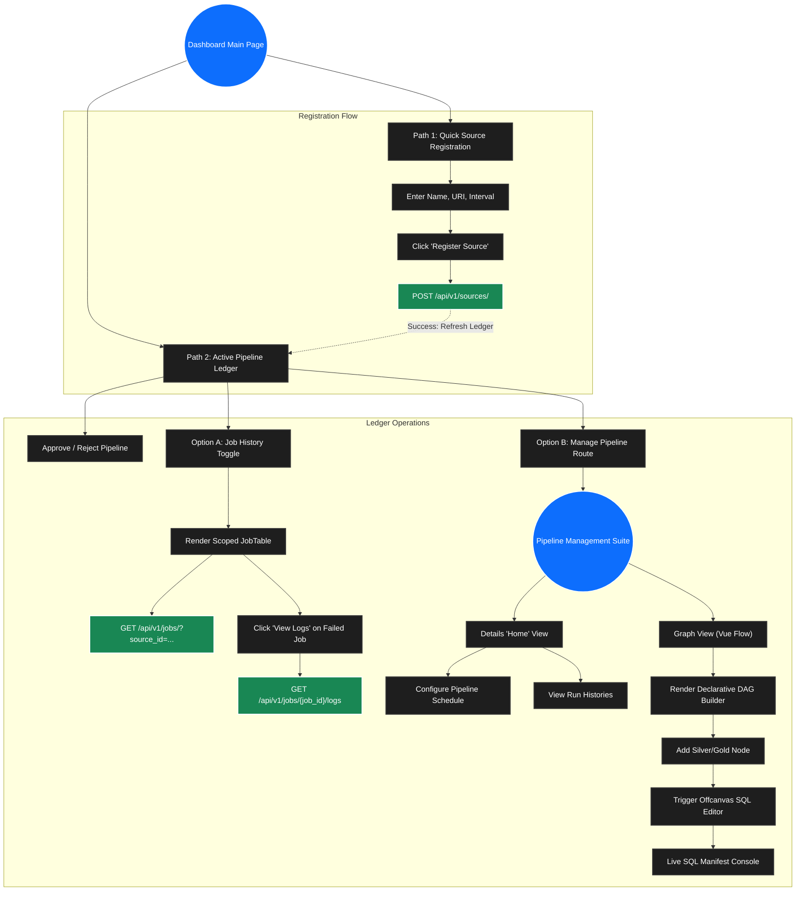

# Pipeline Creation and Management Flow

This document details the user flow and page design for Pipeline Creation and Management within the Elite Dashboard. It acts as the orchestration roadmap starting from the dashboard's main landing page (`/`).

## The Two Primary Paths

When a user lands on the dashboard, they interact with the unified command center which immediately diverges into two primary operational paths for pipeline administration.

### Path 1: Quick Source Registration
This path represents the genesis of a new data pipeline. It allows an administrator to quickly register an external data origin without navigating to a complex configuration screen.

*   **User Action:** The user fills in the "Source Name", "Download URI", and "Interval (Hrs)" within the Quick Registration form.
*   **Trigger:** User clicks the "Register Source" button.
*   **Result:** The UI makes an asynchronous POST request. Upon success, the system creates a new `source_id` in a `pending_hitl` state. The Active Pipeline Ledger is automatically refreshed to display the newly created pipeline.

### Path 2: Active Pipeline Ledger
This path is the primary operational hub where users monitor and maintain registered pipelines. Each pipeline is rendered as a standalone, horizontal "flex card" containing its identity, state (e.g., `approved`), and architectural depth (`BRONZE_SYNCED`, etc.).

From this ledger row, the user has two management options:

#### Option A: Job History (In-Line Diagnostics)
*   **User Action:** The user clicks the "Job History" button (or "Hide History" to toggle).
*   **Trigger:** The UI smoothly expands an accordion component nested directly beneath the pipeline card.
*   **Result:** A scoped `JobTable` is rendered, querying the API for jobs specifically associated with that `source_id`. Users can view the execution status of Bronze/Silver/Gold phases and open a "View Logs" modal for any failed jobs without leaving the main page.

#### Option B: Manage Pipeline (Deep Orchestration)
*   **User Action:** The user clicks the primary "Manage Pipeline" button.
*   **Trigger:** A Vue router navigation event teleports the user to the detailed orchestration view (`/pipelines/:id`).
*   **Result:** The user enters the dedicated pipeline workspace serving as a declarative DAG builder, where they can author SQL templates, visually define data lineage, review the compiled SQL manifest, and schedule or trigger unified pipeline executions.

## User Flowchart

The following flowchart maps the user actions, UI components, and API interactions for these distinct paths.

## State-Mutating Event-to-API Mapping

To ensure strict architectural boundaries and prevent frontend/backend integration ambiguity, all state-mutating UI events must map explicitly to the following API endpoints. Read-only interactions (like opening a node or viewing the Payload Preview) do not trigger network requests.

### 1. Source Registration (Dashboard Level)
*   **UI Event:** User clicks "Register Source" in the Quick Registration form.
*   **Payload:** `{ "name": "Spansh", "uri": "https://...", "interval_hrs": 24 }`
*   **API Target:** `POST /api/v1/sources/`
*   **Result:** Initializes the pipeline and auto-renders the Bronze nodes in the DAG Builder.

### 2. DAG Compilation (Pipeline Level)
*   **UI Event:** User clicks "Deploy & Execute Pipeline" (Step 1: The Commit).
*   **Payload:** The fully structured `LineageGraph` JSON (nodes, edges, compiled SQL).
*   **API Target:** `PUT /api/v1/catalog/dag/{source_id}`
*   **Result:** Persists the entire authored DAG configuration to the SQLite registry.

### 3. Unified Execution (Pipeline Level)
*   **UI Event:** The backend successfully returns `200 OK` from the DAG Compilation event (Step 2: The Execute).
*   **Payload:** Empty body (relies on `{source_id}`).
*   **API Target:** `POST /api/v1/pipeline/run/{source_id}`
*   **Result:** Instructs the orchestrator to traverse the committed DAG and execute transformations.

### 4. Configuration Updates (Pipeline Level)
*   **UI Event:** User modifies the `interval` schedule or pipeline metadata in the Details View.
*   **Payload:** Partial JSON patch of modified fields.
*   **API Target:** `PATCH /api/v1/sources/{source_id}`
*   **Result:** Updates the pipeline's operational configuration.
