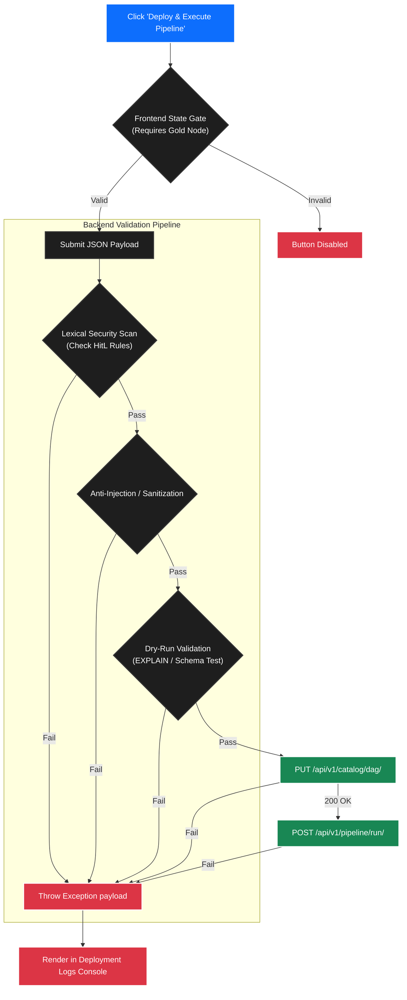

# Pipeline Manager UI Integration Plan

The following outlines the immediate integration targets, architectural rules, and required data models to build the detailed Pipeline Management suite and the enhanced Dashboard Ledger.

### 1. Asset-Oriented "True DAG" Architecture
*   **Rule:** The UI and Pipeline Management must strictly adhere to an **Asset-Oriented** design.
*   **Implementation:** Unlike imperative orchestrators (like Airflow) that graph arbitrary tasks, our "True DAG" graph nodes will explicitly represent the physical database tables (e.g., `raw_spansh`, `stg_users`, `dim_stations`).

### 2. Required View Definitions
The dedicated Pipeline Manager (`/pipelines/:id`) will be segmented into two major, toggleable views:
*   **Details ("Home") View:** A standard web layout for pipeline configuration, scheduling, and reviewing run histories.
*   **Graph View (Declarative DAG Builder):** A massive, full-screen interactive canvas dedicated to authoring the pipeline's logic and data lineage.

### 3. Pipeline Workspace Components & Web-Elements
The Pipeline Management view is composed of several interactive web components designed to orchestrate the DAG:
1.  **Declarative Builder:** A visual interface where users instantiate new nodes, define target table names, and construct lineage. Read-only Bronze nodes auto-render upon source registration.
2.  **Offcanvas Authoring (HitL UI):** Prompted upon node creation or node click, this side-panel contains the SQL Editor for authoring data transformations for Silver and Gold layers.
3.  **Payload Preview (SQL Manifest):** A modal button that opens a real-time, read-only audit record of the SQL generated across all nodes. *Note: This is strictly a compiled SQL Manifest, not a monolithic SQL script. It visually aggregates the isolated SQL templates to prove adherence to the Single Destination Mandate.*
4.  **Debug Console (JSON Payload):** A developer-focused modal button that outputs the exact structured JSON DAG payload (nodes, edges, SQL strings) being actively constructed by the frontend.
5.  **Unified Execution ("Deploy & Execute Pipeline"):** The primary orchestration button. It is protected by a frontend State Gate that disables the button until minimum logical requirements are met (e.g., the DAG must contain at least one valid node in the Gold swim-lane).
6.  **Deployment Logs Console:** A dedicated modal or fixed UI panel designed to catch and display any validation, security, or execution errors returned during the deployment process.

### 4. Graph Interactivity & Authoring
*   **Node Creation (Base Entity Prefixing):** Initiating "Add Node" prompts the user for a "Base Entity Name" (e.g., `users`). The frontend automatically and irreversibly prepends the correct namespace/prefix based on the active swim-lane (`stg_` for Silver, `dim_`/`fct_` for Gold). This assembled string (e.g., `stg_users`) becomes the immutable `node_id`.
*   **Offcanvas SQL Auto-Population:** Upon node creation, the SQL editor auto-populates an immutable wrapper (e.g., `CREATE TABLE silver.stg_users AS \n SELECT \n ... \n;`). The wrapper syntax should be styled as disabled/read-only text, enforcing the rule that the user *only* authors the internal `SELECT` statement.
    *   **Edge Detection:** If a user draws edges from multiple parent nodes to a single child node *before* opening the Offcanvas, the frontend intelligently auto-populates the `FROM` and `JOIN` clauses using the parent `node_id`s, leaving the user to define the `ON` condition.
*   **Transient State vs. Committed State:** The Offcanvas editor manages a strictly local, transient state as the user types. 
    *   **Committing:** The SQL string is only serialized and committed to the central Vue Flow graph state (e.g., binding to `node.data.sql`) when the user explicitly clicks a "Save/Apply" button within the Offcanvas.
    *   **Re-editing:** If a user re-opens the Offcanvas (by clicking the node), the local state is re-hydrated from `node.data.sql` for further editing.
*   **Payload Preview State Reactivity:** The Payload Preview and Debug Console modals DO NOT scrape raw DOM inputs from the Offcanvas. They iterate exclusively over the committed, saved central Vue Flow state. Therefore, these modals will only reflect changes after an Offcanvas "Save/Apply" event, or when an edge is explicitly connected/severed on the canvas.

### 5. Graph Design: Medallion Swim-Lanes
*   **Swim-Lanes Architecture:** The graph canvas organizes nodes visually using strict swim-lanes. The user authors the DAG flowing left-to-right: Bronze lane on the far left (read-only origins), Silver lane in the center, and Gold lane on the right.
*   **Dynamic Status Colors:** Nodes must dynamically change color to reflect their state:
    *   **Green:** Success / Up-to-date.
    *   **Red:** Failed execution / Error.
    *   **Yellow/Orange:** Stale (upstream data has changed, but this node hasn't been updated to reflect it).

### 6. The Deployment Validation Pipeline
When a user clicks the "Deploy & Execute Pipeline" button, a rigorous sequence of validations and transactions occurs. If triggered manually by this button, the orchestrator will bypass the configured `interval` schedule and execute the entire DAG (Bronze -> Silver -> Gold) immediately and sequentially. Automated background runs will strictly adhere to the `interval` schedule.

The deployment sequence follows these mandatory protections:
1.  **Frontend State Gate:** The button remains physically disabled (`disabled` attribute) until the DAG contains at least one node in the Gold swim-lane, and no nodes have empty SQL templates or disconnected edges.
2.  **Lexical Security Scan (HitL Rules):** The backend intercepts the payload and scans all SQL strings against the prohibited operations (`DROP`, `DELETE`, `GRANT`, etc.) outlined in the HitL Rulesets.
3.  **Anti-Injection & Sanitization:** The backend executes parameterized escaping and guards against path traversal or malicious SQL injection attempts within the payload.
4.  **Dry-Run Schema Validation:** The API performs a transactional `EXPLAIN` or schema-only test-run of the SQL payload to ensure topological validity and syntax correctness without mutating physical data.
5.  **Commit Transaction:** Upon passing all checks, the JSON payload is committed to the SQLite registry via `PUT /api/v1/catalog/dag/{source_id}`.
6.  **Execute Transaction:** Following a successful commit, the system fires `POST /api/v1/pipeline/run/{source_id}` to execute the pipeline.
7.  **Error Telemetry:** Any failure in steps 1-6 halts the sequence. The API returns a formatted error payload which is immediately rendered in the frontend's **Deployment Logs Console** to alert the user.

### 6. Enhanced Dashboard Ledger
*   **New Ledger Columns:** The main "Active Pipelines Ledger" must be updated to display `Last Run` (formatted timestamp) and `Next Run` (formatted timestamp).
*   **State Management & Filtering:** The ledger must support quick-filtering toggles for the following explicit operational states: `All`, `Active`, `Paused`, `Failed`, `Running`, and `Archived`.
