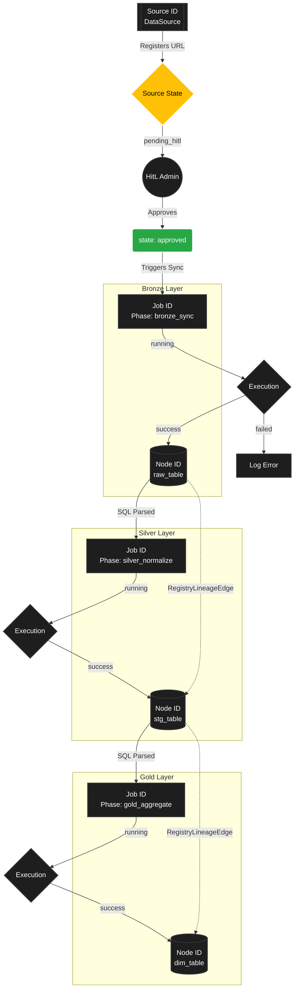
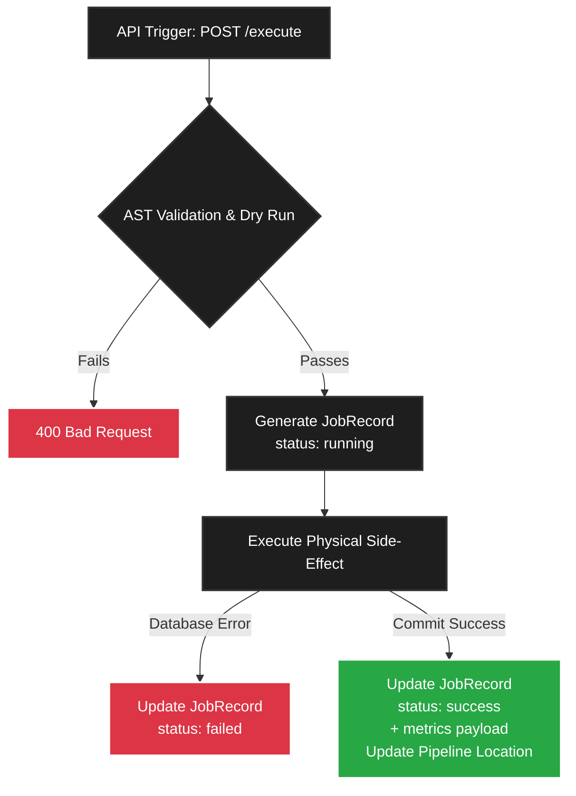

# Pipeline State and ID Hierarchy

This document explains the hierarchical relationship between the various Identifiers (UUIDs) and state markers that govern data flow within the Elite Dangerous Medallion Pipeline. Understanding this hierarchy is essential for diagnosing pipeline stalls and tracing data lineage.

## The Three Core Identifiers

The ETL pipeline strictly separates the concept of a **Source**, its **Executions**, and its resulting **Data Assets**. This is achieved through three distinct UUID namespaces.

### 1. Source ID (`DataSource`)
The `source_id` is the root identifier for an external data origin (e.g., the Spansh Galaxy JSON dump). It is a permanent record that persists for the lifetime of the application.
*   **Purpose:** Defines *where* the data comes from and its ingestion cadence.
*   **State Machine (`state`):**
    *   `pending_hitl`: Newly registered; awaiting Human-in-the-Loop review.
    *   `approved`: Administrator authorized; allowed to trigger Bronze ingestion.
    *   `rejected`: Administrator blocked; pipeline halts.
    *   `error`: Network or schema validation permanently failed.

### 2. Job ID (`JobRecord`)
A `job_id` is a transient identifier representing a single attempt to move data from one layer to the next. A single `source_id` will spawn hundreds of `job_id` records over its lifetime.
*   **Purpose:** Acts as a historical ledger for executions and error logs.
*   **Phase Designations:** `bronze_sync`, `silver_normalize`, or `gold_aggregate`.
*   **State Machine (`status`):**
    *   `running`: The background worker is actively processing the data.
    *   `success`: The data was successfully committed to Postgres.
    *   `failed`: An error occurred (e.g., malformed SQL, network timeout). Execution halts.
    *   `skipped`: Bypassed because the `source_id` was not `approved`, or the file hash (ETag) remained unchanged.

### 3. Node ID (`LineageNode`)
A `node_id` represents a physical table realized inside PostgreSQL (e.g., `bronze.raw_spansh`, `silver.stg_spansh_stations`).
*   **Purpose:** The fundamental building block of the Directed Acyclic Graph (DAG) rendered by the frontend dashboard.
*   **Relationships:** Nodes are connected together by `LineageEdge` UUIDs, generated dynamically by the AST Parser during Silver/Gold SQL validation.

---

## State Transition Flowchart

The following flowchart illustrates how a Source progresses through the Medallion architecture, generating Jobs and Nodes along the way.



## Summary of the Journey

1.  A new URL is registered, minting a **Source ID** in the `pending_hitl` state.
2.  An Administrator sets the Source ID to `approved`.
3.  A `bronze_sync` **Job ID** is created in the `running` state.
4.  If successful, the Job ID enters `success` and registers a `raw_...` **Node ID**.
5.  Administrator writes SQL to transform the `raw_...` table into a staging table.
6.  A `silver_normalize` **Job ID** executes the SQL, creating a `stg_...` **Node ID** and mapping a dependency edge back to the Bronze Node ID.
7.  The process repeats for Gold, spawning a `gold_aggregate` **Job ID** and a `dim_...` **Node ID**.

## Implementation: Tracking Pipeline Location
To track a Source's physical depth within the architecture (its maximum realized progression), a `location` property is proposed for the `RegistryDataSource` model. While `state` tracks authorization, `location` maps the event-driven progression of data.

**Proposed Enum Values (`MedallionDepth`):**
1.  **`REGISTERED`:** The URL is in the database, but no data has been downloaded yet. (Default state).
2.  **`BRONZE_SYNCED`:** The DLT engine has successfully extracted the payload and generated `raw_` tables.
3.  **`SILVER_NORMALIZED`:** The HitL admin has executed at least one successful transformation resulting in a `stg_` table.
4.  **`GOLD_AGGREGATED`:** The data has successfully reached the final business tier as a `dim_` or `fct_` table.

This property would be event-driven, automatically patching the Source record when a `JobRecord` successfully completes its respective Medallion phase.

## Conceptual Distinction: Source vs. Pipeline

Historically, the `RegistryDataSource` model conflated the concepts of an origin connection and the data's orchestrated journey. To ensure scalable UI and backend design, these identities are conceptually distinct.

> **Important Note:** We will promote **Pipeline** to the primary unified entity of the dashboard. It will serve as the root navigation object that encapsulates configuration, historical jobs, and DAG lineage.

### The Source (The Origin Connection)
The Source represents strictly the "where" and "what". It defines the immutable physical connection to the outside world.
*   **Identification Properties:**
    *   `source_id` (UUID)
    *   `protocol` (e.g., HTTP, Webhook, S3)
    *   `download_uri` (e.g., `https://downloads.spansh.co.uk/...`)
    *   `auth_credentials` (e.g., API keys)
    *   `etag` / `last_modified` (Upstream state tracking)

### The Pipeline (The Orchestration Unit)
The Pipeline represents the "how" and "when". It is the primary entity the user manages, and it mathematically *owns* a Source connection.
*   **Identification Properties:**
    *   `pipeline_id` (UUID - the primary key for the dashboard)
    *   `name` (e.g., `spansh_populated` - dictates database schema naming)
    *   `fk_source_id` (Reference to the Origin Connection)
    *   `schedule_interval_hours` (Execution frequency)
    *   `hitl_state` (`pending`, `approved`, `rejected`)
    *   `medallion_depth` (`REGISTERED`, `BRONZE`, `SILVER`, `GOLD`)
*   **Ownership:** A Pipeline owns all execution history (`JobRecords`) and the generated Directed Acyclic Graph (`LineageGraph`).

## Execution Observability: Jobs and Job Records

In a mature data engineering platform, the `JobRecord` is a critical observability entity. It acts as the permanent ledger of execution attempts, ensuring you can audit when data was updated, why a pipeline failed, and how long transformations took to execute.

### When to Trigger a Job Record

Job Records are strictly generated to wrap **side-effect operations** (network ingestion, disk writes, or physical database execution). They should *never* track transient validations like "Dry Runs".

1. **Bronze Ingestion:** Triggered exactly when the backend initializes the `dlt` loader to extract the external JSON payload and push it into the Postgres `bronze` schema.
2. **Silver Normalization:** Triggered exactly when the backend establishes a Postgres connection to physically execute the parsed `CREATE TABLE AS SELECT` templates against the `silver` schema.
3. **Gold Aggregation:** Triggered exactly when the backend establishes a Postgres connection to physically execute the parsed aggregation SQL against the `gold` schema.

### Core Side-Effect Operations to Track

To ensure high observability, the `JobRecord` tracks distinct metrics based on the Medallion phase executing:

1.  **Network Ingestion & Raw Load (Bronze Phase)**
    *   **Side-Effect:** External HTTP GET and database load.
    *   **Properties to Track:** `bytes_downloaded`, `etag_hash` (to prove upstream state changes), and `tables_generated`.
2.  **Normalization Transformation (Silver Phase)**
    *   **Side-Effect:** Relational mapping in Postgres.
    *   **Properties to Track:** `rows_affected` (ensuring volume isn't accidentally dropped), `execution_time_ms`, and `templates_executed`.
3.  **Business Aggregation (Gold Phase)**
    *   **Side-Effect:** Complex JOIN/GROUP BY operations in Postgres.
    *   **Properties to Track:** `rows_affected`, `execution_time_ms`, and `templates_executed`.

### Job Execution Flowchart



### The Remodeled JobRecord Dataclass

To support this granular tracking, the core domain model should be extended to accept a flexible `metrics` JSON object that adapts to the specific Medallion phase.

```python
from enum import Enum
from typing import Optional, Dict, Any
from datetime import datetime
from uuid import UUID, uuid4
from pydantic import BaseModel, Field

class JobStatus(str, Enum):
    RUNNING = "running"
    SUCCESS = "success"
    FAILED = "failed"
    SKIPPED = "skipped"

class MedallionPhase(str, Enum):
    BRONZE_SYNC = "bronze_sync"
    SILVER_NORMALIZE = "silver_normalize"
    GOLD_AGGREGATE = "gold_aggregate"

class JobRecord(BaseModel):
    id: UUID = Field(default_factory=uuid4)
    pipeline_id: UUID
    phase: MedallionPhase
    status: JobStatus = Field(default=JobStatus.RUNNING)
    
    # Observability Payload
    metrics: Dict[str, Any] = Field(default_factory=dict)
    error_log: Optional[str] = None
    
    started_at: datetime = Field(default_factory=datetime.utcnow)
    completed_at: Optional[datetime] = None

    class Config:
        from_attributes = True
```

## Backend Implementation Requirements (Analysis of the Gap)

While this document perfectly defines the theoretical model, the following physical changes must be implemented in the Python codebase to actively support the `dashboard-home-view-plan.md` architecture:

### 1. Database Model Migrations (`models.py`)
*   **The `location` Property:** The `location` (MedallionDepth) Enum column must be added to the `RegistryDataSource` SQLAlchemy model.
*   **The `metrics` Payload:** A `JSON` column must be added to the `RegistryJobRecord` model to store the dynamic observability data (`bytes_downloaded`, `rows_affected`, etc.).

### 2. Event-Driven Logic (`service.py`)
*   Currently, when a Bronze/Silver/Gold job finishes, the system only logs a "success" status on the job itself. We must explicitly append logic to reach back to the parent Pipeline and patch its `location` state (e.g., bumping it from `BRONZE_SYNCED` to `SILVER_NORMALIZED`).

### 3. API Enhancements (`routers/jobs.py`)
*   To support the Proxmox-style chronological ledger, the `GET /api/v1/jobs/` endpoint must ensure it queries the SQLite database ordered by `started_at DESC`. It also strictly requires a `limit` parameter (e.g., last 50 jobs) to prevent crashing the frontend with thousands of historical runs.
