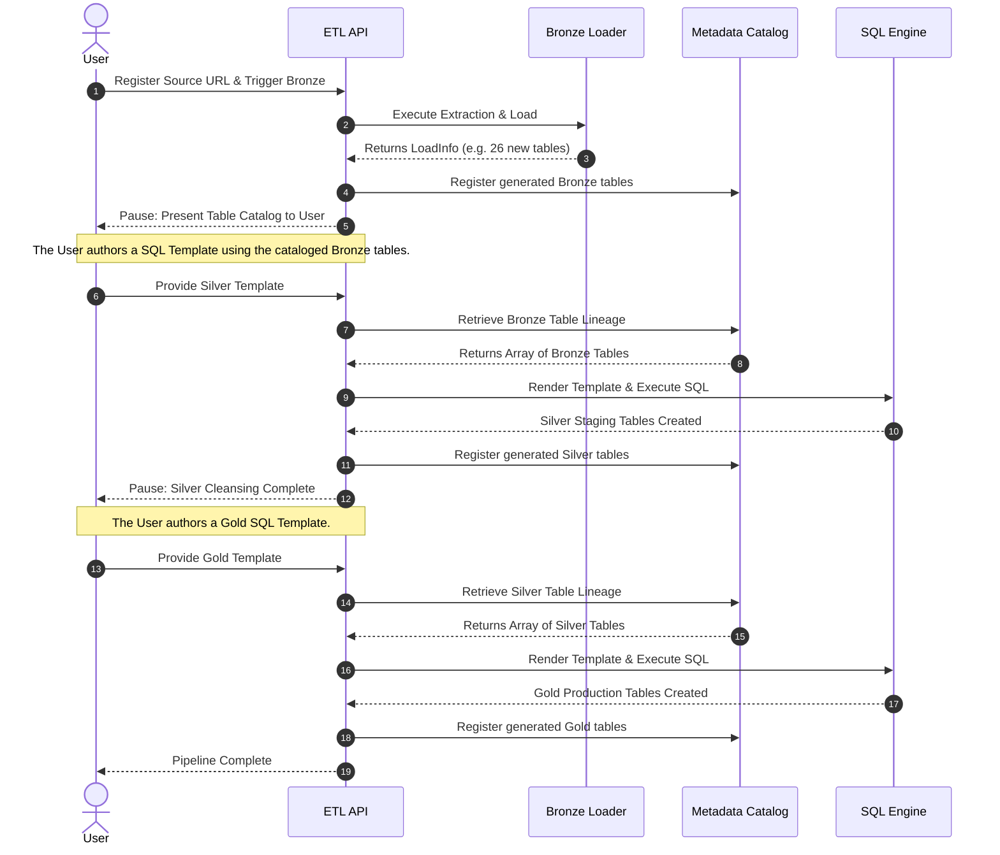

# Elite ETL: Release & Integration Roadmap

This document outlines the strategic sequence required to finalize the `elite_etl` pipeline, transitioning it from a localized development project into a versioned, self-contained Python package ready for integration into external applications (such as the `elite_engine`).

## Phase 1: Git Housekeeping & Stabilization
Before a package can be built or decoupled, the repository must be stabilized and cleaned.
*   **Audit Current State & Documentation Alignment:** Ensure all Hexagonal Architecture components (Phases A-D) are fully committed and tested. Compare the as-built code against the master design documents (`etl-pipeline-practices.md`, `master-etl-workflow.md`, `api-architecture-design.md`). 
    *   *Professional Practice Note:* The working, as-built code is the Single Source of Truth. Do not create new documents to explain discrepancies. Instead, directly update the existing master documents to reflect the working reality. This prevents documentation bloat and reduces token usage.
*   **Merge Strategy:** 
    1. Merge the current working development/buildout branch onto the main refactor branch.
    2. Perform a Pull-Request (PR) onto the true `main` branch.
*   **Prune Legacy Branches:** Delete all deprecated, experimental, or legacy branches to prevent developer confusion and ensure a clean working tree.

## Phase 2: Decoupling & Agnosticizing (Domain Separation)
Currently, Phases C and D (Silver/Gold) have hard-coded Elite Dangerous specifics. We must make the pipeline completely agnostic so it can process *any* dataset.
*   **Branching:** Branch off from the newly stabilized `main` branch (e.g., `feature/agnostic-pipeline`).
*   **Identify Coupling Points:** Review the infrastructure adapters (specifically `sql_transformer.py` and `sql_aggregator.py`). Locate all hard-coded references to specific data domains (e.g., table names like `raw_spansh_galaxy`, `stg_spansh_galaxy`, or specific column selections).
*   **Decoupling Logic & Modules:** Engineer a configuration injection layer. The `SilverService` and `GoldService` must accept transformation schemas as external arguments, decoupling the Python execution logic from the SQL text.
*   **Suggested Tooling:** 
    *   **Jinja2:** For lightweight, fast dynamic SQL string templating inside Python.
    *   **dbt-core:** For heavy, modular SQL transformations (via `dlt.helpers.dbt`), shifting transformation logic entirely out of Python into domain-specific `.sql` files.
*   **Git Resolution:** Once the pipeline is successfully decoupled, repeat the PR process: merge back into `main` and delete the decoupling branch.

### Architectural Blueprint: The Interactive ELT Workflow
Because the Bronze layer dynamically explodes raw JSON into unpredictable relational schemas (often dozens of nested tables), the ETL API cannot blindly proceed to Silver. It must pause and request explicit user mapping instructions. This separates automated extraction from human-driven transformation.



### The Refactored Silver Workflow
To fully decouple the Silver layer using Jinja2 and the Data Lineage Catalog, the pipeline executes the following sequence:

1.  **Catalog Retrieval:** The Silver Service queries the `Data Lineage Catalog` in SQLite to retrieve the exact names of all Bronze tables generated for the given source (e.g., all 27 tables for `spansh_populated`).
2.  **Template Resolution:** The `sql_transformer.py` adapter searches the `src/infrastructure/sql_templates/` directory for a user-provided Jinja `.sql` template matching the source name (e.g., `spansh_populated_silver.sql`).
3.  **Template Rendering (Jinja2):** The transformer uses the Python `jinja2` library to inject variables (like the schema names and the cataloged Bronze tables) directly into the user's `.sql` template. This renders the template into an executable PostgreSQL query string.
4.  **SQL Execution:** The transformer connects to PostgreSQL via `psycopg2` and executes the rendered query to create the cleansed Silver tables.
5.  **Silver Lineage Update:** The Silver Service passes the newly created Silver table names back to the `Data Lineage Catalog` (layer="silver"). This ensures the Gold service has a perfect registry of the cleansed tables waiting for it.

### Architectural Blueprint: The Human-in-the-Loop (HitL) API Handshake
To execute the Silver and Gold workflows dynamically, the API and the User must exchange a specific "Handshake" where the API provides the raw schema context, and the User provides an array of SQL mapping instructions.

#### 1. The Menu & Schema Introspection (API -> User)
When Bronze completes, the user asks the API for the cataloged tables. To prevent the user from having to manually open a database client (like pgAdmin) to inspect the data, the API performs **Schema Introspection**. It queries PostgreSQL's `information_schema.columns` to provide the exact blueprints of the dynamically generated tables.

*   **Endpoint:** `GET /bronze/catalog/{source_id}`
*   **Response Payload:**
    ```json
    {
      "source_id": "93eb2b95-adc6-412d-8c49-a18de9e71b4d",
      "layer": "bronze",
      "tables": [
        {
          "table_name": "raw_spansh_populated__bodies",
          "columns": [
            {"name": "id", "data_type": "bigint"},
            {"name": "name", "data_type": "text"},
            {"name": "distance_to_arrival", "data_type": "double precision"}
          ]
        },
        {
          "table_name": "raw_spansh_populated__stations",
          "columns": [
            {"name": "id", "data_type": "bigint"},
            {"name": "body_id", "data_type": "bigint"},
            {"name": "station_name", "data_type": "text"}
          ]
        }
      ]
    }
    ```

#### 2. The Recipe (User -> API)
The user reviews the Bronze tables and determines exactly how they want to join, cleanse, and split them into Silver tables. They send an array of SQL queries back to the API.
*   **Endpoint:** `POST /silver/normalize/{source_id}`
*   **Request Payload (The Array Approach):**
    ```json
    {
      "dry_run": true,
      "transformations": [
        {
          "target_table": "stg_bodies",
          "sql": "SELECT id, name AS body_name FROM bronze.raw_spansh_populated__bodies;"
        },
        {
          "target_table": "stg_stations",
          "sql": "SELECT id, type AS station_type FROM bronze.raw_spansh_populated__stations;"
        }
      ]
    }
    ```

#### 3. Server-Side Validation (Dry Run)
Before storing or executing the SQL, the API must securely validate it in isolation to prevent crashing the system or leaving halfway-created junk tables. Client-side validation cannot detect missing columns or schema mismatches.
*   **The Transactional Rollback:** When `dry_run: true` is passed, the API opens a PostgreSQL connection and explicitly triggers a `BEGIN;` transaction. It executes the user's SQL, capturing any database-level exceptions (e.g., `ERROR: column "x" does not exist`). 
*   **Failure:** If PostgreSQL throws an error, the API intercepts it and returns a `400 Bad Request` containing the exact PostgreSQL error string to the user.
*   **Success:** If the table successfully renders in memory, the API immediately executes a `ROLLBACK;`. This destroys the temporary state without committing anything to the active database. The API returns a `200 OK: Validation Passed`.

#### 4. Storage and Execution: Code vs. State
In software engineering, there is a strict separation between **Code** (version-controlled logic) and **State** (the database). The pipeline is a "dumb" execution engine. When the API receives this array, it must store and execute it using a **Reference Pointer** model:

*   **Write Code to Filesystem:** The API saves the raw SQL string to persistent `.sql` files (e.g., `data/sql_templates/silver_spansh_populated_v1.sql`). Storing these locally ensures they survive container reboots, allows developers to get syntax highlighting/Git tracking, and provides an explicit trail for debugging.
*   **Update the Lineage Catalog:** It updates the `SourceTable` SQLite record for that generated Silver table, adding a new column called `transformation_template_path`. This preserves the unbroken lineage map (Bronze -> Template File -> Silver).

    ```json
    // The conceptual Lineage Record in SQLite
    {
      "layer": "silver",
      "table_name": "stg_spansh_populated",
      "source_id": "93eb2b95-adc6-412d-8c49-a18de9e71b4d",
      "transformation_template_path": "data/sql_templates/silver_spansh_populated_v1.sql"
    }
    ```
*   **Execution:** The `sql_transformer.py` adapter reads the `.sql` files specified by the lineage pointer, renders any remaining Jinja2 variables if necessary, and executes them in sequence against the PostgreSQL database.

### Architectural Blueprint: The Data Lineage Catalog (Metadata Module)
To make the Interactive ELT Workflow function safely, the ETL pipeline requires a dedicated **Data Lineage Catalog**. This module tracks the pedigree of every dataset from URL to final Gold table, ensuring we never blindly guess table names.

#### Core Objectives
*   **Prevent Naming Collisions:** Explicitly track exactly what tables `dlt` generated.
*   **Auditability:** Link every Postgres table row directly back to the SHA-256 hash of the origin JSON file.
*   **UX/Onboarding:** Provide the API a precise list of tables to present to the user when requesting Silver/Gold SQL templates.

#### OOP Design Structure
The catalog will be implemented as a unified, encapsulated module within the Registry domain to adhere to the Single Responsibility Principle (SRP).

1.  **The ORM Model (`SourceTable`)**
    A new SQLite table mapping one-to-many from the `DataSource` registry.
    *   `id`: UUID (Primary Key)
    *   `source_id`: UUID (Foreign Key to `DataSource`)
    *   `medallion_layer`: Enum (`bronze`, `silver`, `gold`)
    *   `table_name`: String (e.g., `raw_spansh_populated__bodies`)
    *   `row_count`: Integer
    *   `created_at` / `updated_at`: Timestamps

2.  **The Interface (`ILineageCatalog`)**
    Defines the contract for cataloging data without tying it to SQLite.
    *   `register_tables(source_id, layer, load_info_dict)`
    *   `get_tables_for_source(source_id, layer)`

3.  **The Implementation (`SqliteLineageCatalog`)**
    The concrete class that parses the `python-dlt` `LoadInfo` object, extracts the dynamically generated table names, and persists them into the SQLite registry database.

## Phase 3: Package Configuration (`pyproject.toml`)
To allow external applications to seamlessly import the ETL pipeline, the repository must be configured as a standard Python package.
*   **Scaffold `pyproject.toml`:** Create the modern Python packaging configuration file in the repository root.
*   **Define Metadata:** Explicitly define the package name (e.g., `elite_etl`), version, and author.
*   **Declare Dependencies:** Map all required third-party libraries (`fastapi`, `uvicorn`, `python-dlt`, `psycopg2`, `pydantic`, `httpx`) so they auto-install when the package is imported by a parent application.

## Phase 4: Semantic Versioning (SemVer)
We must freeze the stable state of the pipeline so dependent applications do not break if we make future changes to the ETL logic.
*   **Establish Baseline:** Declare the fully functional, agnostic pipeline as `v1.0.0`.
*   **Git Tagging:** Apply a Git tag (e.g., `git tag -a v1.0.0 -m "Initial stable agnostic release"`) to the main branch. This allows external tools to specifically install this exact immutable snapshot.

## Phase 5: Integration Documentation
A package is useless without explicit instructions on how to instantiate it. We must write a dedicated Integration Guide targeting external developers/services.
*   **Installation Instructions:** How to install via pip (e.g., `pip install git+https://github.com/yourusername/elite_quick.git@v1.0.0`).
*   **Environment Configuration:** Clearly document the mandatory `.env` variables required for the package to function (specifically `DESTINATION__POSTGRES__CREDENTIALS` and SQLite paths).
*   **Execution Paths:** Document the two ways an external application can use the package:
    1.  **Standalone API:** How to spin up the bundled FastAPI server to trigger jobs via HTTP.
    2.  **Direct Python Import:** How an external script can directly import `from src.domain.bronze.service import BronzeService` and execute jobs natively.
