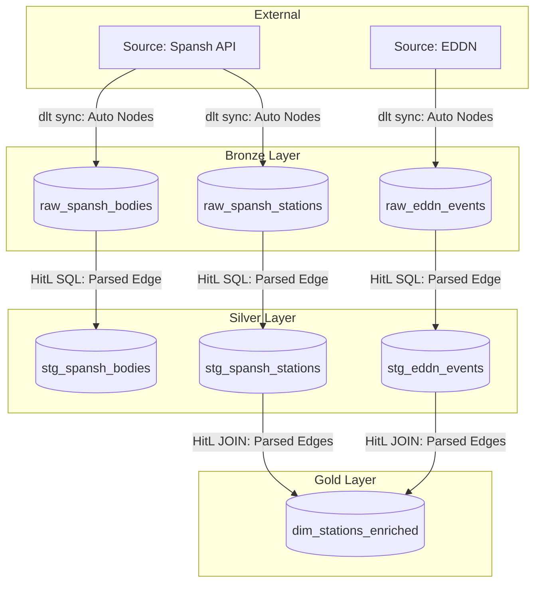
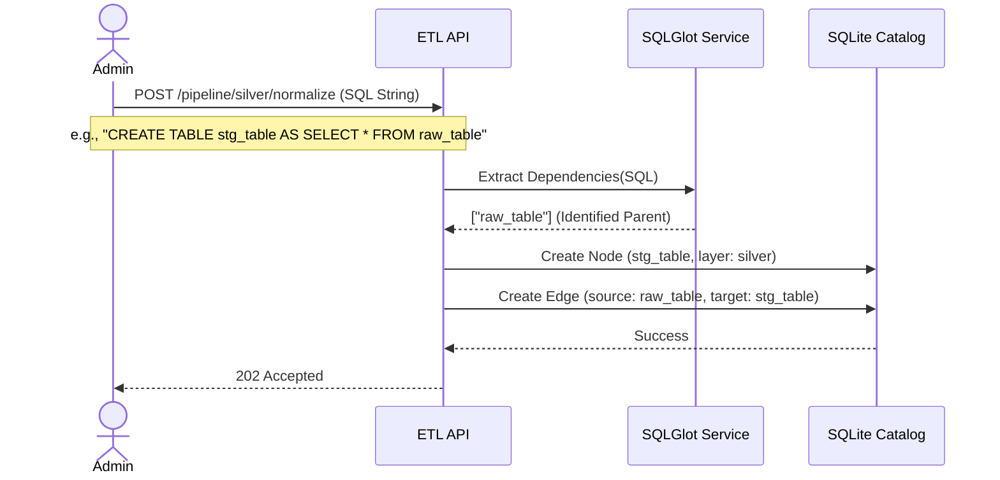

# Transitioning to a True DAG Architecture

This document outlines the strategic plan for upgrading the Elite Dangerous ETL Pipeline from simple layer-state tracking to a strict Directed Acyclic Graph (DAG) architecture. 

## 1. The Necessity of a True DAG

While the current Human-in-the-Loop (HitL) architecture tracks which tables exist within the Medallion layers (Bronze, Silver, Gold), it is blind to the relational dependencies between those tables. Moving to a true DAG is necessary to solve the following critical operational limitations:

1. **Deterministic Execution (Orchestration):** Without explicit edges, the scheduler cannot safely determine the execution order of multiple Silver/Gold scripts. A true DAG guarantees that parent tables are processed before their dependent children, preventing pipeline crashes.
2. **Proactive Impact Analysis:** If a third-party API alters its schema (e.g., dropping a Bronze column), a DAG enables the backend to programmatically calculate and flag exactly which downstream dashboards will break.
3. **Granular Re-runs:** A true DAG allows operators to trigger micro-syncs (e.g., "recalculate this specific Gold table and only its direct parents") rather than inefficiently reprocessing the entire Medallion layer.
4. **Accurate Visualization:** The frontend dashboard (`NodeGraph.vue`) requires a node-and-edge JSON structure to visually render the exact flow of data through the warehouse for the administrator.

---

## 2. The Lifecycle of DAG Creation

The DAG is dynamically constructed in memory and persisted to the registry incrementally as data moves through the Medallion architecture.

1. **Bronze (The Roots):** The DAG strictly begins at the Bronze layer. When `python-dlt` extracts JSON from an external source (e.g., Spansh) and un-nests the arrays into PostgreSQL, the API automatically registers these raw tables as the **Root Nodes** of the DAG. No edges exist yet.
2. **Silver (Forging Edges):** The user writes a SQL template to normalize a Bronze table into a Silver table. When submitted, the backend parses the SQL, identifies the `FROM` Bronze table, creates a new Silver **Node**, and explicitly records an **Edge** linking the Bronze parent to the Silver child.
3. **Gold (Cross-Source Convergence):** The user writes a SQL template to aggregate data for reporting. This template may `JOIN` multiple Silver tables (even from entirely different external Sources). The backend parses this, creates the Gold **Node**, and records multiple **Edges** from the respective Silver parents, effectively merging isolated pipelines into a unified Global DAG.

### Conceptual Flowchart



### Sequence Diagram: DAG Edge Generation



---

## 3. Architectural Alteration Plan

To maintain backend simplicity while enabling relational tracking, we will implement **The Parser Route**. The backend will dynamically infer the DAG by parsing the user's raw SQL templates, requiring zero syntax changes from the administrator.

### Phase 1: SQLite Registry Upgrades (Infrastructure)
The database must be upgraded to store dependency edges.
1. **Schema Migration:** Create a new `RegistryLineageEdge` table in SQLite with `source_table_id` and `target_table_id` columns.
2. **Repository Update:** Update `SqliteLineageCatalog` to persist these edges when a SQL template is validated and saved.

### Phase 2: The Parsing Implementation (Domain Logic)
We will introduce `sqlglot` to parse the raw SQL without executing it.
1. **Dependency Injection:** Add `sqlglot` to the backend dependencies (`pyproject.toml` / `requirements.txt`).
2. **Parser Service:** Create a new domain service (e.g., `src/domain/lineage/parser.py`) that accepts a raw SQL string, walks the Abstract Syntax Tree (AST), and extracts all identifiers found in `FROM` and `JOIN` clauses.

### Phase 3: API Pipeline Modifications (Primary Adapters)
The normalization endpoints must build the graph before execution.
1. **Intercept Validation:** Modify `POST /api/v1/pipeline/silver/normalize` and `POST /api/v1/pipeline/gold/aggregate`. During the "Dry Run" validation step, pass the user's SQL to the Parser Service.
2. **Catalog Edges:** If validation passes, the API commits the parsed dependencies (edges) into the SQLite registry alongside the Node metadata.

### Phase 4: Lineage Endpoint Overhaul
The graph payload must conform to standard visualization expectations.
1. **Graph Construction:** Refactor `GET /api/v1/catalog/lineage/{source_id}` to query both `RegistrySourceTable` (Nodes) and `RegistryLineageEdge` (Edges).
2. **JSON Schema Update:** The endpoint will now return a strict DAG payload:
   ```json
   {
     "graph": {
       "nodes": [
         {"id": "raw_spansh", "layer": "bronze"}
       ],
       "edges": [
         {"source": "raw_spansh", "target": "stg_spansh"}
       ]
     }
   }
   ```

### Phase 5: Dashboard Integration
1. **Update API Reference:** Document the new JSON schema in `elite_dashboard/docs/reference/api-endpoints.md`.
2. **Vue NodeGraph:** Ensure the Vue component accurately maps the `graph.nodes` and `graph.edges` objects to render the deterministic data lineage map.
