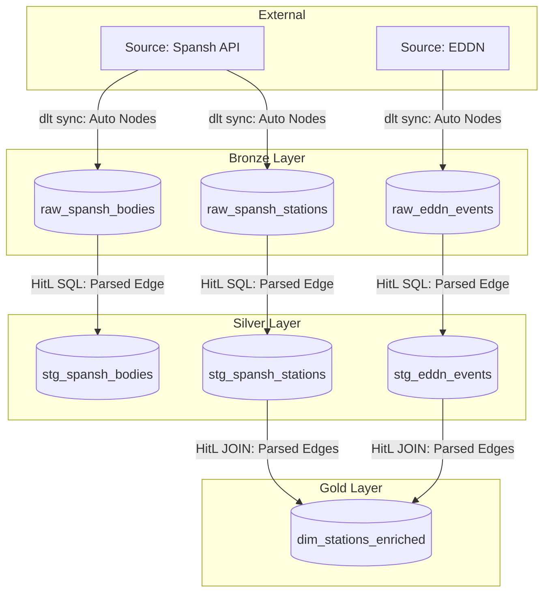
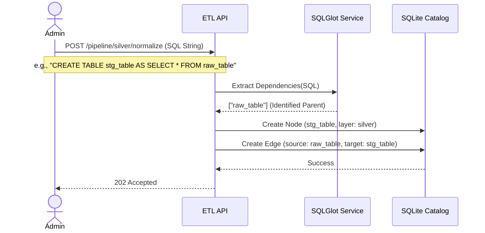

# Transitioning to a True DAG Architecture

This document outlines the strategic plan for upgrading the Elite Dangerous ETL Pipeline from simple layer-state tracking to a strict Directed Acyclic Graph (DAG) architecture. 

## 1. The Necessity of a True DAG

While the current Human-in-the-Loop (HitL) architecture tracks which tables exist within the Medallion layers (Bronze, Silver, Gold), it is blind to the relational dependencies between those tables. Moving to a true DAG is necessary to solve the following critical operational limitations:

1. **Deterministic Execution (Orchestration):** Without explicit edges, the scheduler cannot safely determine the execution order of multiple Silver/Gold scripts. A true DAG guarantees that parent tables are processed before their dependent children, preventing pipeline crashes.
2. **Proactive Impact Analysis:** If a third-party API alters its schema (e.g., dropping a Bronze column), a DAG enables the backend to programmatically calculate and flag exactly which downstream dashboards will break.
3. **Granular Re-runs:** A true DAG allows operators to trigger micro-syncs (e.g., "recalculate this specific Gold table and only its direct parents") rather than inefficiently reprocessing the entire Medallion layer.
4. **Accurate Visualization:** The frontend dashboard (`NodeGraph.vue`) requires a node-and-edge JSON structure to visually render the exact flow of data through the warehouse for the administrator.

---

## 2. The Lifecycle of DAG Creation

The DAG is dynamically constructed in memory and persisted to the registry incrementally as data moves through the Medallion architecture.

1. **Bronze (The Roots):** The DAG strictly begins at the Bronze layer. When `python-dlt` extracts JSON from an external source (e.g., Spansh) and un-nests the arrays into PostgreSQL, the API automatically registers these raw tables as the **Root Nodes** of the DAG. No edges exist yet.
2. **Silver (Forging Edges):** The user writes a SQL template to normalize a Bronze table into a Silver table. When submitted, the backend parses the SQL, identifies the `FROM` Bronze table, creates a new Silver **Node**, and explicitly records an **Edge** linking the Bronze parent to the Silver child.
3. **Gold (Cross-Source Convergence):** The user writes a SQL template to aggregate data for reporting. This template may `JOIN` multiple Silver tables (even from entirely different external Sources). The backend parses this, creates the Gold **Node**, and records multiple **Edges** from the respective Silver parents, effectively merging isolated pipelines into a unified Global DAG.

### DAG Ratios & UI Implementation

To preserve perfect lineage, the DAG must support **Many-to-Many (N:M)** relationships, as pipelines change shapes across layers:
*   **1:1 (Normalization):** A single raw table is cast into a staging table (`raw_users` → `stg_users`).
*   **1:N (Fan-Out):** A single raw table is split into multiple staging tables (`raw_activity` → `stg_logins`, `stg_purchases`).
*   **N:1 (Fan-In/Convergence):** Multiple staging tables are joined into a single reporting table (the hallmark of the Gold layer).

**The "Blanket SQL" Anti-Pattern:**
To allow the SQLGlot parser to successfully extract these relationships, the Dashboard UI must **never** allow a user to submit a single, monolithic text block containing multiple `CREATE TABLE` commands. The UI must enforce a strict **1 Template = 1 Target Table** rule. If an admin wishes to perform a 1:N fan-out affecting 5 tables, the UI must construct a JSON array of 5 distinct SQL payloads, ensuring the API always knows exactly which final node the parsed edges point to.

### Prohibited SQL & Security Validation

To protect pipeline integrity and DAG metadata, the API validation layer must intercept and reject templates containing the following illegal SQL operations:
1. **Infrastructure Alteration:** `CREATE DATABASE`, `DROP DATABASE`, `GRANT`, `REVOKE` (Users are ETL developers, not DBAs).
2. **Transaction Controls (TCL):** `BEGIN`, `COMMIT`, `ROLLBACK` (The Python API automatically wraps executions to guarantee safe DAG rollbacks; manual injection breaks this).
3. **Destructive Mutability in Bronze:** `DELETE`, `TRUNCATE`, `DROP TABLE` against the `bronze` schema (Bronze is the immutable source of truth and must remain strictly read-only for user SQL).
4. **Operating System Escapes:** `COPY ... FROM PROGRAM` or unauthorized Postgres extensions like `dblink` (Massive security vulnerabilities).
5. **Registry Tampering:** Any `INSERT`, `UPDATE`, or `DELETE` targeting the system metadata or `registry` schema (Only the automated Python API may write to the DAG metadata).

### Logic and Safety Checks

To enforce the architecture and maintain a pristine DAG, the backend API must execute these five sequential validation checks before executing any user code against the database:

1. **Lexical Validation (Security):** Are there multiple statements?
   *   *Tooling:* `sqlparse`
   *   *Action:* The API passes the payload to `sqlparse.split()`. It strictly enforces the "Single Destination Mandate." If the lexer detects `count > 1` statements, it returns `400 Bad Request`.
2. **AST Validation (Security & Boundaries):** Are there prohibited keywords? Is a Gold table illegally trying to read from Bronze? What are the parent tables?
   *   *Tooling:* `sqlglot`
   *   *Action:* The API converts the string to an AST. It intercepts prohibited DDL/TCL nodes (e.g., `exp.Drop`). It extracts the `FROM` tables to verify schema boundaries (rejecting `bronze.` access in Gold) and captures the exact parent nodes.
3. **Acyclicity Validation (DAG Logic):** Does creating this relationship cause an infinite loop (A -> B -> A)?
   *   *Tooling:* SQLite (Custom Registry)
   *   *Action:* The API takes the parent tables extracted by `sqlglot` and queries the SQLite `RegistryLineageEdge` table (via a Recursive CTE) to verify the new edges do not form a circular graph loop.
4. **Syntax Validation (Database):** Is the SQL mathematically valid?
   *   *Tooling:* PostgreSQL `EXPLAIN`
   *   *Action:* The API prefixes the user's SQL with the `EXPLAIN` keyword and sends it to the database. Postgres parses the syntax without executing the query. If a syntax error exists, the `psycopg2` driver catches it before data is touched.
5. **Semantic Validation (Database):** Do the referenced tables and columns exist, and are the data types compatible for the requested `JOIN`s?
   *   *Tooling:* PostgreSQL `EXPLAIN`
   *   *Action:* During the same `EXPLAIN` execution, the PostgreSQL engine validates the query against the database catalogs. It guarantees that all requested columns exist and that data types can be successfully joined, throwing precise errors (e.g., `column does not exist`) if semantic rules are violated.

### Layer-Specific Boundary Rules

To enforce the Medallion architecture, the parser must apply different rules depending on which layer the user is building:

**Bronze → Silver (Normalization Zone):**
*   **Prohibit Cross-Source JOINs:** Silver is meant for cleaning a single source. The parser should reject templates that attempt to join a Spansh Bronze table with an EDDN Bronze table.
*   **Strict Schema Target:** Must exclusively target the `silver` schema.

**Silver → Gold (Aggregation Zone):**
*   **Encourage Cross-Source Convergence:** This is where isolated pipelines merge to create unified business logic.
*   **Prohibit Direct Bronze Access (No Layer Skipping):** If the parser detects any reference to the `bronze` schema in a Gold template's `FROM` or `JOIN` clauses, it must reject the payload. Gold tables are only permitted to read from `silver` tables. 
*   **Strict Schema Target:** Must exclusively target the `gold` schema.

### Conceptual Flowchart



### Sequence Diagram: DAG Edge Generation



---

## 3. Required Tooling

To programmatically enforce these rules and achieve true DAG generation without forcing the user to learn a proprietary templating language (like `dbt`'s Jinja), the pipeline requires three distinct security/parsing layers:

### 1. `sqlparse` (The Lightweight Lexer)
*   **What it is:** A fast, non-validating Python parser that splits raw strings into discrete SQL statements.
*   **What it does:** It instantly counts the number of discrete statements (separated by `;`) in a user's payload.
*   **Where it fits:** Positioned at the very front of the API Router as a fast fail-check to strictly enforce the **Single Destination Mandate** before handing complex work over to the AST parser.

### 2. `sqlglot` (The Heavyweight AST Parser)
*   **What it is:** An open-source Python SQL parser and transpiler.
*   **What it does:** It takes raw SQL text and converts it into a mathematical Abstract Syntax Tree (AST). It can traverse this tree to extract metadata, such as every table name referenced next to a `FROM` or `JOIN` keyword, and can detect prohibited operations (e.g., `exp.Drop`).
*   **Where it fits:** It will be wrapped inside a new domain service (`src/domain/lineage/parser.py`) and invoked exclusively during the "Dry Run" validation step of the Silver (`/normalize`) and Gold (`/aggregate`) API endpoints to draw the DAG edges and intercept illegal TCL/DDL.

### 3. PostgreSQL Roles (The Ultimate Backstop)
*   **What it is:** Native PostgreSQL Database-Level permissions (Data Control Language - DCL).
*   **What it does:** Python parsers can occasionally be tricked by obscure syntax. The ultimate security measure is to execute the user's SQL using a heavily restricted Postgres role (e.g., `etl_developer`). This role is explicitly `DENY`'d the ability to run `DELETE` on the `bronze` schema, and lacks `SUPERUSER` rights to create databases or execute OS commands. 
*   **Where it fits:** Configured in the `infrastructure` layer (e.g., inside our Docker `init.sql` initialization scripts) to physically guarantee pipeline integrity at the metal level.

---

## 4. Architectural Alteration Plan

To maintain backend simplicity while enabling relational tracking, we will implement **The Parser Route**. The backend will dynamically infer the DAG by parsing the user's raw SQL templates, requiring zero syntax changes from the administrator.

### Phase 1: SQLite Registry Upgrades (Infrastructure)
The database must be upgraded to store dependency edges.
1. **Schema Migration:** Create a new `RegistryLineageEdge` table in SQLite with `source_table_id` and `target_table_id` columns.
2. **Repository Update:** Update `SqliteLineageCatalog` to persist these edges when a SQL template is validated and saved.

### Phase 2: The Parsing Implementation (Domain Logic)
We will introduce `sqlglot` to parse the raw SQL without executing it.
1. **Dependency Injection:** Add `sqlglot` to the backend dependencies (`pyproject.toml` / `requirements.txt`).
2. **Parser Service:** Create a new domain service (e.g., `src/domain/lineage/parser.py`) that accepts a raw SQL string, walks the Abstract Syntax Tree (AST), and extracts all identifiers found in `FROM` and `JOIN` clauses.

### Phase 3: API Pipeline Modifications (Primary Adapters)
The normalization endpoints must build the graph before execution.
1. **Intercept Validation:** Modify `POST /api/v1/pipeline/silver/normalize` and `POST /api/v1/pipeline/gold/aggregate`. During the "Dry Run" validation step, pass the user's SQL to the Parser Service.
2. **Catalog Edges:** If validation passes, the API commits the parsed dependencies (edges) into the SQLite registry alongside the Node metadata.

### Phase 4: Lineage Endpoint Overhaul
The graph payload must conform to standard visualization expectations.
1. **Graph Construction:** Refactor `GET /api/v1/catalog/lineage/{source_id}` to query both `RegistrySourceTable` (Nodes) and `RegistryLineageEdge` (Edges).
2. **JSON Schema Update:** The endpoint will now return a strict DAG payload:
   ```json
   {
     "graph": {
       "nodes": [
         {"id": "raw_spansh", "layer": "bronze"}
       ],
       "edges": [
         {"source": "raw_spansh", "target": "stg_spansh"}
       ]
     }
   }
   ```

### Phase 5: Dashboard Integration
1. **Update API Reference:** Document the new JSON schema in `elite_dashboard/docs/reference/api-endpoints.md`.
2. **Vue NodeGraph:** Ensure the Vue component accurately maps the `graph.nodes` and `graph.edges` objects to render the deterministic data lineage map.
