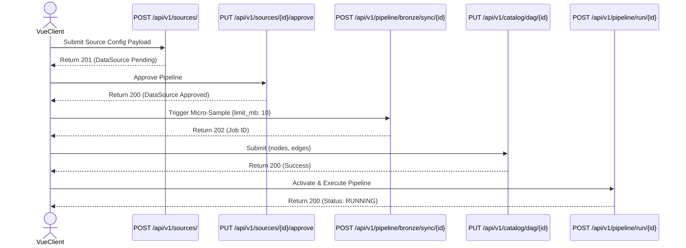
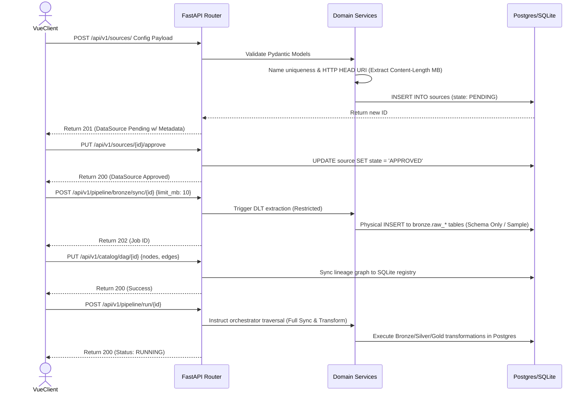

# FLOW-01: End-to-End Pipeline Onboarding & Execution

Triggers the complete flow from registering a new external data source through to its first unified pipeline execution.

### Rules to Abide By
1. **DAG Prerequisite Rule:** The system strictly prohibits full-volume Bronze extraction and loading until a complete Silver/Gold DAG has been authored and committed by the user.
2. **Micro-Sampling:** To enable DAG authoring, the system performs a restricted "Micro-Sample" (e.g., 10MB) immediately following approval. This provides `dlt` just enough data to infer schemas and build empty raw tables for the UI to introspect, without bloating the database.
3. **HitL Boundaries:** Registration and Approval remain strictly manual human-in-the-loop checkpoints.

#### 1. Client-Side API Sequence (Black Box)

#### 2. Full-Stack Architecture Sequence (White Box)

## Endpoint Sequence Mapping

**Target Payload Note:** The payload for Step 01 reflects the Target State (v2) design to support dynamic schemas and authentication.

| Step | Endpoint | Payload / Params | Key Output Captured |
| :--- | :--- | :--- | :--- |
| 01 | `POST /api/v1/sources/` | `{name, uri, interval_hrs, source_type, auth_strategy, credentials_id}` | `id`, `metadata.estimated_size_mb` |
| 02 | `PUT /api/v1/sources/{source_id}/approve` | Empty | `state: APPROVED` |
| 03 | `POST /api/v1/pipeline/bronze/sync/{source_id}`| `{limit_mb: 10}` (Micro-sample) | `job_id` |
| 04 | `PUT /api/v1/catalog/dag/{source_id}` | `{nodes: [], edges: []}` | `status: success` |
| 05 | `POST /api/v1/pipeline/run/{source_id}` | Empty | `status: RUNNING` |
| 06 | `GET /api/v1/pipeline/status/{source_id}` | Empty | `completed_nodes`, `pending_nodes` |

## TODO
- [ ] Implement `HTTP HEAD` request in Domain Service to extract `Content-Length` (MB) for the Pending response payload to assist in HitL approval UX.
- [ ] Develop way of processing different URIs and accept APIs (beyond static file downloads).
- [ ] Develop way of securely passing credential information and registering it alongside the source.