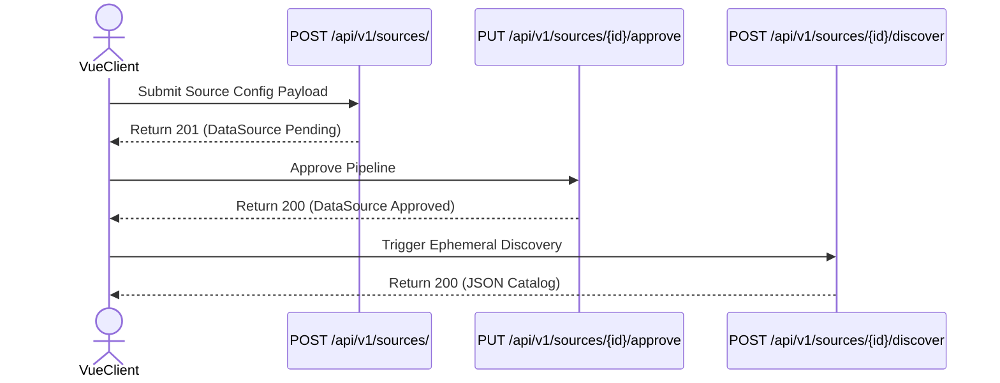
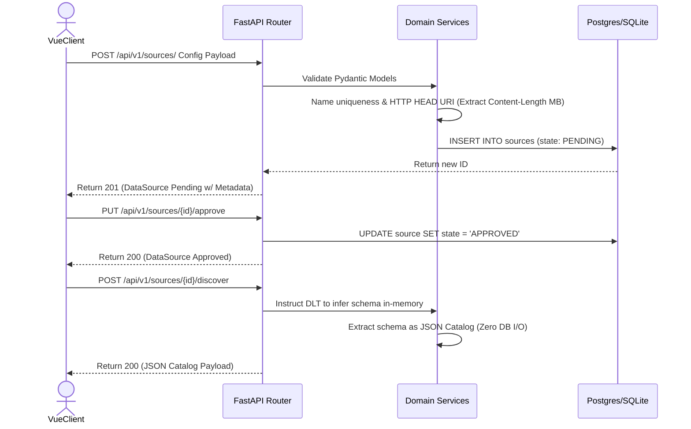

# FLOW-01: Source Registration & Approval

Triggers the Administrative Onboarding Phase where a data source is registered, securely approved, and micro-sampled to prepare for DAG authoring.

### Rules to Abide By
1. **DAG Prerequisite Rule:** The system strictly prohibits physical PostgreSQL table instantiation or data loading until a complete Silver/Gold DAG has been authored and executed.
2. **Ephemeral Discovery:** To enable DAG authoring, the system performs an in-memory "Discovery" extraction immediately following approval. This provides `dlt` just enough data to infer schemas and yield a JSON Catalog, strictly without touching the destination database.
3. **HitL Boundaries:** Registration and Approval remain strictly manual human-in-the-loop checkpoints.

#### 1. Client-Side API Sequence (Black Box)

#### 2. Full-Stack Architecture Sequence (White Box)

## Endpoint Sequence Mapping

**Target Payload Note:** The payload for Step 01 reflects the Target State (v2) design to support dynamic schemas and authentication.

| Step | Endpoint | Request Payload | Response Payload | Key Output Captured |
| :--- | :--- | :--- | :--- | :--- |
| 01 | `POST /api/v1/sources/` | `{"name": "...", "uri": "...", "interval_hrs": 24, "source_type": "...", "auth_strategy": "...", "credentials_id": "..."}` | `{"id": "...", "state": "PENDING", "metadata": {"estimated_size_mb": 150}}` | `id`, `metadata.estimated_size_mb` |
| 02 | `PUT /api/v1/sources/{source_id}/approve` | Empty | `{"id": "...", "state": "APPROVED"}` | `state: APPROVED` |
| 03 | `POST /api/v1/sources/{source_id}/discover` | Empty | `{"tables": {"raw_users": {"columns": {"id": "integer", "name": "string"}}}}` | JSON Catalog Schema |

## API Endpoints Definition

### 1. Register Source
*   **Method**: `POST`
*   **URI**: `/api/v1/sources/`
*   **Request Payload**: `{"name": "string", "uri": "string", "interval_hrs": "integer", "source_type": "string", "auth_strategy": "string", "credentials_id": "string"}`
*   **Response Payload**: `{"id": "uuid", "state": "PENDING", "metadata": {"estimated_size_mb": "float"}}`

### 2. Approve Source
*   **Method**: `PUT`
*   **URI**: `/api/v1/sources/{source_id}/approve`
*   **Request Payload**: None
*   **Response Payload**: `{"id": "uuid", "state": "APPROVED"}`

### 3. Ephemeral Schema Discovery
*   **Method**: `POST`
*   **URI**: `/api/v1/sources/{source_id}/discover`
*   **Request Payload**: None
*   **Response Payload**: `{"tables": {"<table_name>": {"columns": {"<col_name>": "<type>"}}}}`

## TODO
- [ ] Implement `HTTP HEAD` request in Domain Service to extract `Content-Length` (MB) for the Pending response payload to assist in HitL approval UX.
- [ ] Develop way of processing different URIs and accept APIs (beyond static file downloads).
- [ ] Develop way of securely passing credential information and registering it alongside the source.