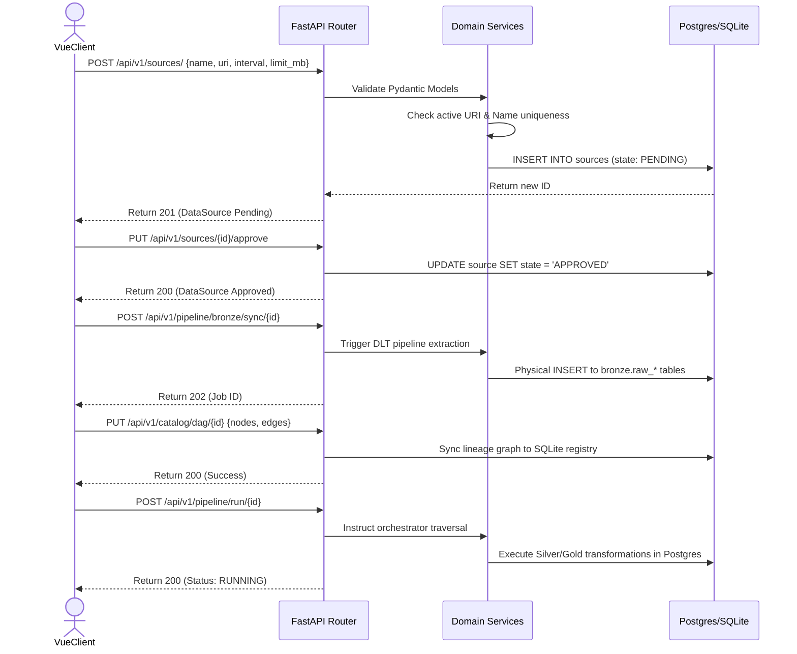

# FLOW-01: End-to-End Pipeline Onboarding & Execution

Triggers the complete flow from registering a new external data source through to its first unified pipeline execution.

## Endpoint Sequence Mapping

| Step | Endpoint | Payload / Params | Key Output Captured |
| :--- | :--- | :--- | :--- |
| 01 | `POST /api/v1/sources/` | `{name, uri, interval_hrs, limit_mb (opt)}` | `id` (source_id) |
| 02 | `PUT /api/v1/sources/{source_id}/approve` | Empty | `state: APPROVED` |
| 03 | `POST /api/v1/pipeline/bronze/sync/{source_id}`| `{limit_mb}` (optional override) | `job_id` |
| 04 | `PUT /api/v1/catalog/dag/{source_id}` | `{nodes: [], edges: []}` | `status: success` |
| 05 | `POST /api/v1/pipeline/run/{source_id}` | Empty | `status: RUNNING` |
| 06 | `GET /api/v1/pipeline/status/{source_id}` | Empty | `completed_nodes`, `pending_nodes` |

## TODO
- [ ] Develop way of processing different URIs and accept APIs (beyond static file downloads).
- [ ] Develop way of securely passing credential information and registering it alongside the source.