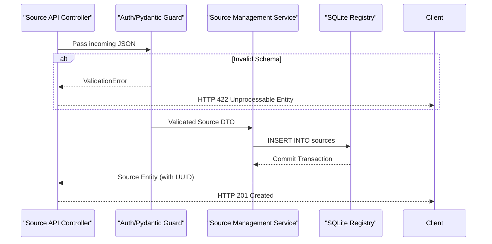

# Backend Workflow: Source Registration

## 1. Objective
Persist a new physical data source into the Domain 1 catalog.

## 2. Trigger
API receives `POST /api/v1/sources/` containing the Source payload.

## 3. Domain Routing
1.  **Controller (Ports):** FastAPI receives the request and utilizes Pydantic to validate the input schema (e.g., ensuring the `uri` is a valid connection string).
2.  **Source Management Service (Domain 1):** The service receives the validated DTO. It checks for uniqueness (e.g., ensuring the name or URI isn't already registered if policy dictates).
3.  **Persistence (Adapters):** The service commits the entity to the SQLite database.

## 4. White-Box Sequence Diagram

## 5. Database Side-Effects
*   **`sources` Table:** Inserts one new row. `id` is generated as a UUID, `state` defaults to `PENDING` (or `APPROVED` depending on HitL policy), `last_discovered_at` is `null`.
