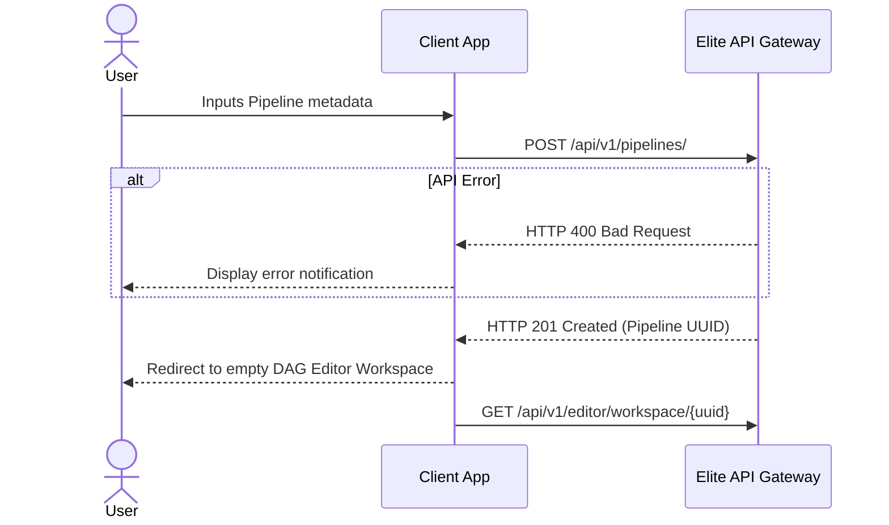

# Client Workflow: Pipeline Registration

## 1. Objective
Allow the user to create a high-level logical Pipeline shell, defining its execution schedule before any mathematical DAG logic is authored.

## 2. Trigger
The user clicks "Create Pipeline", inputs a name and a cron schedule interval, and clicks "Save".

## 3. API Contract
*   **Endpoint:** `POST /api/v1/pipelines/`
*   **Payload:**
    ```json
    {
      "name": "Daily User Aggregation",
      "schedule_cron": "0 0 * * *"
    }
    ```

## 4. Black-Box Sequence Diagram



## 5. Success/Error States
*   **Success (201 Created):** The pipeline shell is created. The UI transitions the user directly to the Canvas Editor and fetches the newly created workspace via the BFF endpoint.
*   **Error (400/422):** Returns validation errors if the cron string is malformed. UI displays helper text.
