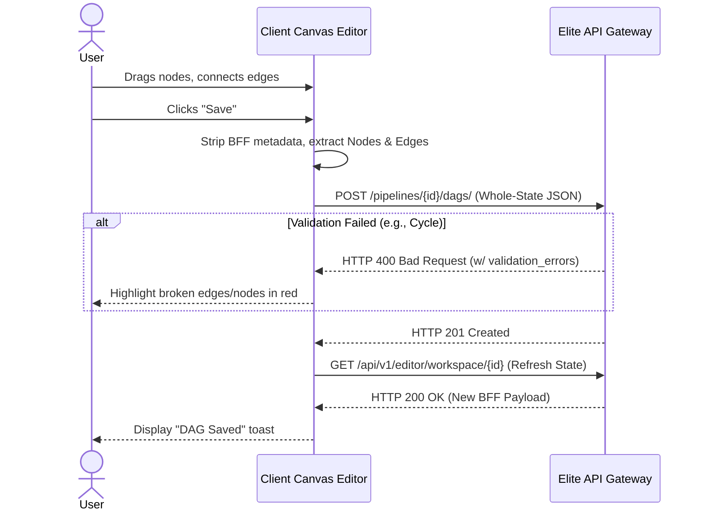

# Client Workflow: DAG Creation

## 1. Objective
Allow the user to construct a directed acyclic graph by dragging data sources onto a canvas, wiring nodes together, writing SQL transformations, and saving the mathematical structure.

## 2. Trigger
The user clicks "Save DAG" in the Editor workspace after arranging nodes and edges.

## 3. API Contract
*   **Endpoint:** `POST /api/v1/pipelines/{pipeline_id}/dags/`
*   **Payload:**
    ```json
    {
      "description": "Initial DAG load",
      "nodes": [ ... ],
      "edges": [ ... ]
    }
    ```

## 4. Black-Box Sequence Diagram



## 5. Success/Error States
*   **Success (201):** The UI re-fetches the workspace from the BFF to ensure the client state matches the server's mathematically derived `inferred_schema` calculations.
*   **Error (400):** If the backend schema validation service or cyclic checker rejects the payload, the UI parses the `validation_errors` array and visually marks the offending nodes or edges on the canvas.
