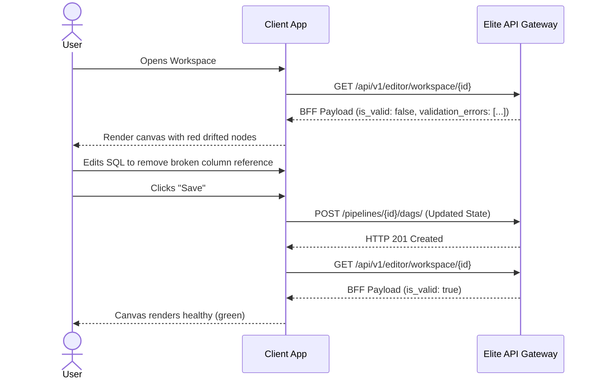

# Client Workflow: Editing Existing DAG

## 1. Objective
Allow the user to modify an existing DAG, potentially to resolve a schema drift error flagged by the BFF.

## 2. Trigger
The user navigates to an existing pipeline workspace. The BFF payload indicates `is_valid = false` due to a background discovery drift. The user fixes the offending SQL template and clicks "Save DAG".

## 3. API Contract
*   **Endpoint:** `POST /api/v1/pipelines/{pipeline_id}/dags/` (Same endpoint as creation; acts as Whole-State Replacement).

## 4. Black-Box Sequence Diagram

## 5. Success/Error States
*   **Success (201):** The user's changes satisfy the strict backend validation services. The BFF now returns `is_valid: true`.
*   **Error (400):** The user failed to remove all references to the dropped column. Backend validation rejects the mutation.
