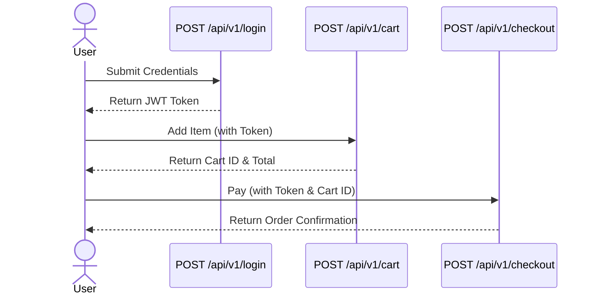

# Userflow Development and Testing

To take your API endpoint documentation and turn it into verifiable, integrated user flows, you can follow this clean four-step pipeline.

## 1. Identify Endpoints & Map the Sequence

To transition from static endpoints to a logical user flow, map the user's business goal to the technical state changes required.

*   **Define the Goal:** Start with a high-level user objective (e.g., "User purchases a subscription").
*   **Trace the State Dependency:** Identify the prerequisite data for each step. If Step B requires an `order_id` from Step A, Step A must run first.
*   **Draft the Sequence:** List the required HTTP methods and URIs in order of execution.

## 2. Document the Workflow in Markdown

Use Mermaid.js (native to GitHub, VitePress, and most Markdown viewers) to write text-based, version-controlled sequence diagrams, paired with a metadata table.

### Example Markdown Strategy

**FLOW-01: User Item Purchase**
Triggers the complete flow from authentication to successful payment.



| Step | Endpoint | Payload / Params | Key Output Captured |
| :--- | :--- | :--- | :--- |
| 01 | `POST /login` | `{username, password}` | `token` |
| 02 | `POST /cart` | `{item_id, qty}` + Header Auth | `cart_id` |
| 03 | `POST /checkout` | `{cart_id, payment_method}` | `order_id`, `status: paid` |

## 3. Arrange Pytests for the User Flow

To test sequences, avoid splitting steps into isolated test functions. If Step 2 fails, Step 3 cannot run. Instead, **group the sequence inside a single test function** and pass state (IDs, tokens) variables sequentially.

Here is a simple, direct Python implementation using `httpx` (or `requests`):

```python
# test_user_flows.py
import httpx

BASE_URL = "https://api.example.com/v1"

def test_flow_01_user_purchase():
    """
    FLOW-01: User Item Purchase Flow
    Ensures login, cart addition, and checkout function sequentially.
    """
    client = httpx.Client(base_url=BASE_URL)

    # Step 1: Authentication
    login_resp = client.post("/login", json={"username": "testuser", "password": "password123"})
    assert login_resp.status_code == 200
    token = login_resp.json()["token"]
    
    # Update client headers for subsequent authenticated requests
    client.headers.update({"Authorization": f"Bearer {token}"})

    # Step 2: Add Item to Cart
    cart_resp = client.post("/cart", json={"item_id": 42, "qty": 1})
    assert cart_resp.status_code == 201
    cart_data = cart_resp.json()
    assert "cart_id" in cart_data
    cart_id = cart_data["cart_id"]

    # Step 3: Checkout
    checkout_resp = client.post("/checkout", json={"cart_id": cart_id, "payment_method": "stripe"})
    assert checkout_resp.status_code == 200
    assert checkout_resp.json()["status"] == "paid"
```

## 4. Align Documentation with Test Scripts

To ensure your documentation and test suite do not drift apart, enforce a strict naming convention:

*   **ID Mapping:** Prefix every workflow in your Markdown documentation with a unique identifier (e.g., `FLOW-01`, `FLOW-02`).
*   **Test Function Names:** Name your pytest functions using the exact same ID: `def test_flow_01_user_purchase():`.
*   **Pytest Markers:** Use `pytest.mark` to tag flow tests so you can run them independently from your unit tests.

### Implementation

```python
import pytest

@pytest.mark.user_flow
@pytest.mark.flow_id("FLOW-01")
def test_flow_01_user_purchase():
    # ... test logic ...
    pass
```

You can then run only your user flow tests using the command line:

```bash
python3 -m pytest -m user_flow
```
